<div align="center">

# 🚀 PCQ FIR Pilot App

### A Modern Flutter Application for Gate Pass Management

[](https://flutter.dev)
[](https://dart.dev)
[](LICENSE)
[](#-supported-platforms)

**A production-ready Flutter application with real-time connectivity monitoring, intelligent offline handling, and comprehensive gate pass management system.**

[Features](#-features) • [Screenshots](#-screenshots) • [Architecture](#-architecture) • [Getting Started](#-getting-started) • [Documentation](#-documentation)

</div>

---

## 📱 Screenshots

### 🌓 Light & Dark Theme Support

<details open>
<summary><b>📸 Authentication</b></summary>

<table>
  <tr>
    <td align="center"><b>Light Mode</b></td>
    <td align="center"><b>Dark Mode</b></td>
  </tr>
  <tr>
    <td>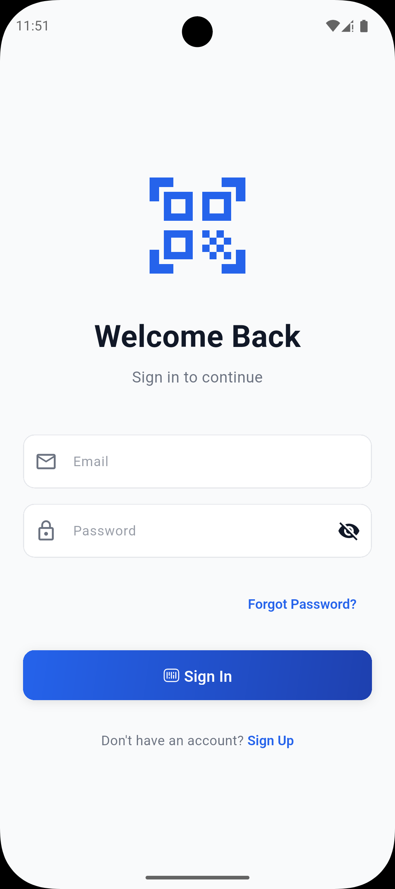</td>
    <td>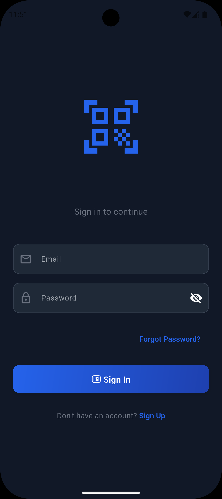</td>
  </tr>
  <tr>
    <td colspan="2" align="center"><i>Secure authentication with Material Design 3</i></td>
  </tr>
</table>

</details>

<details open>
<summary><b>📊 Dashboard & Analytics</b></summary>

<table>
  <tr>
    <td align="center"><b>Light Mode</b></td>
    <td align="center"><b>Dark Mode</b></td>
  </tr>
  <tr>
    <td>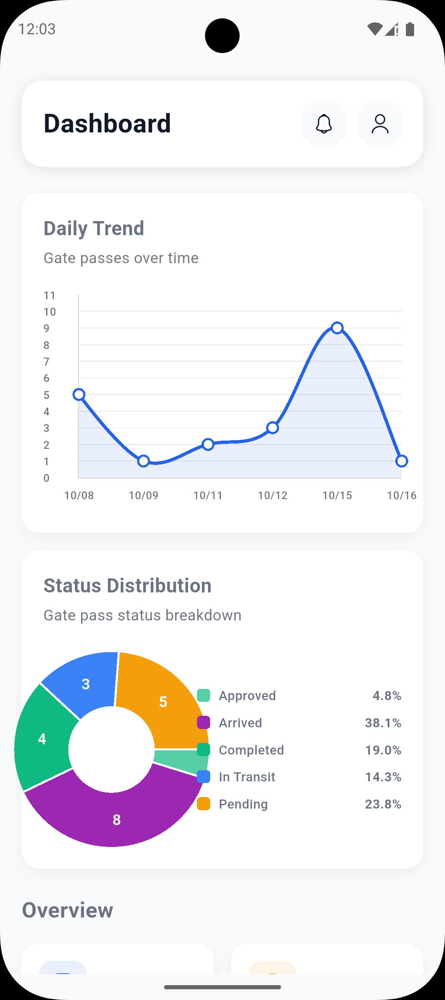</td>
    <td>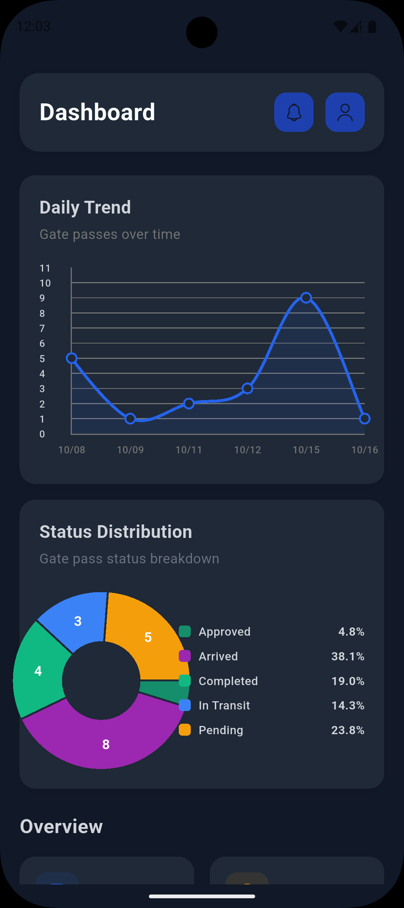</td>
  </tr>
  <tr>
    <td colspan="2" align="center"><i>Real-time dashboard with interactive charts</i></td>
  </tr>
  <tr>
    <td>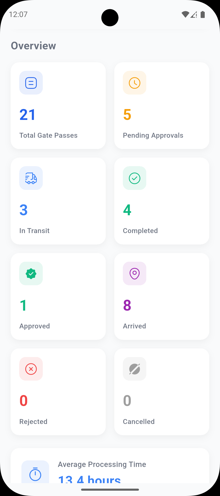</td>
    <td>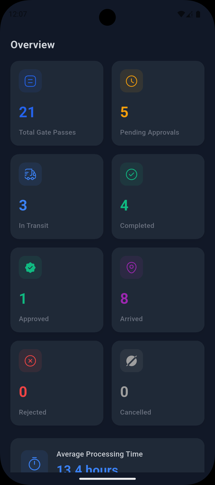</td>
  </tr>
  <tr>
    <td colspan="2" align="center"><i>Detailed analytics and statistics</i></td>
  </tr>
  <tr>
    <td>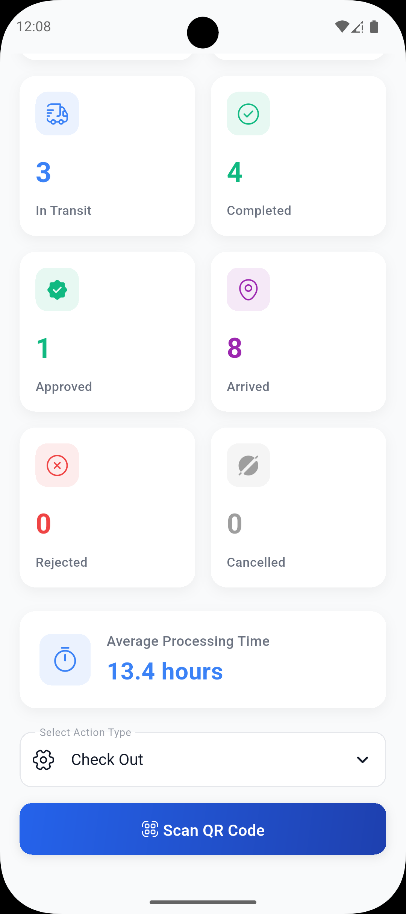</td>
    <td>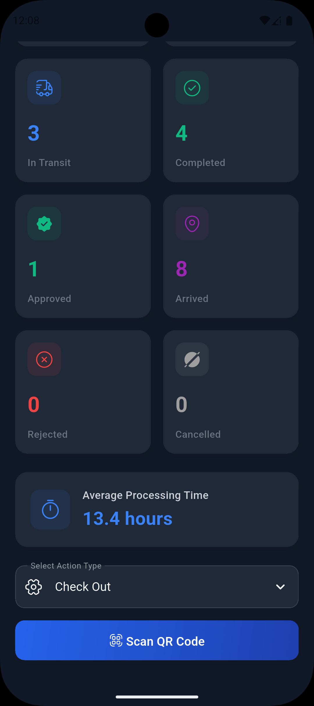</td>
  </tr>
  <tr>
    <td colspan="2" align="center"><i>Member management interface</i></td>
  </tr>
</table>

</details>

<details open>
<summary><b>🎫 Gate Pass Management</b></summary>

<table>
  <tr>
    <td align="center"><b>Light Mode</b></td>
    <td align="center"><b>Dark Mode</b></td>
  </tr>
  <tr>
    <td>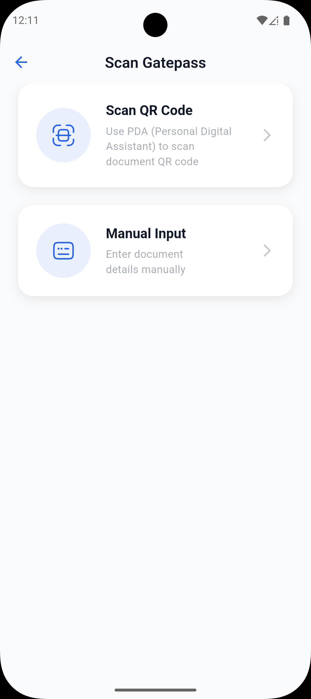</td>
    <td>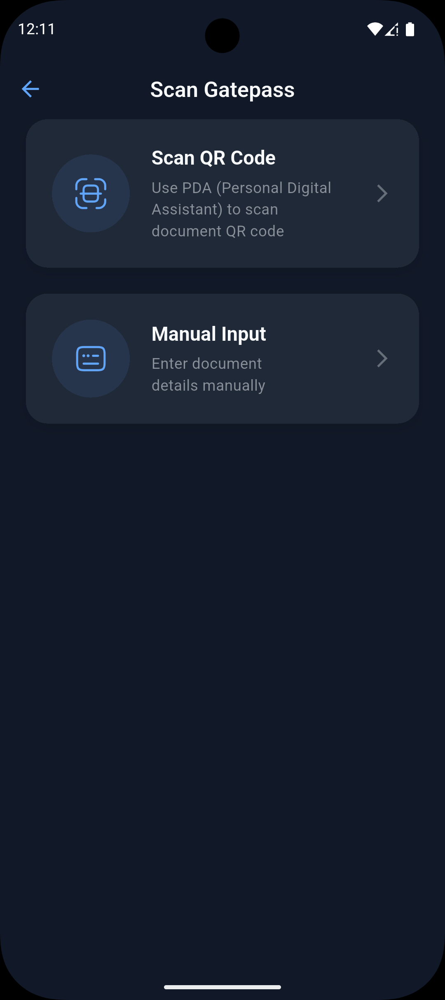</td>
  </tr>
  <tr>
    <td colspan="2" align="center"><i>QR code scanning for gate pass verification</i></td>
  </tr>
  <tr>
    <td>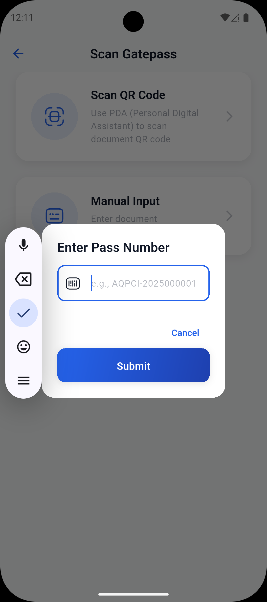</td>
    <td>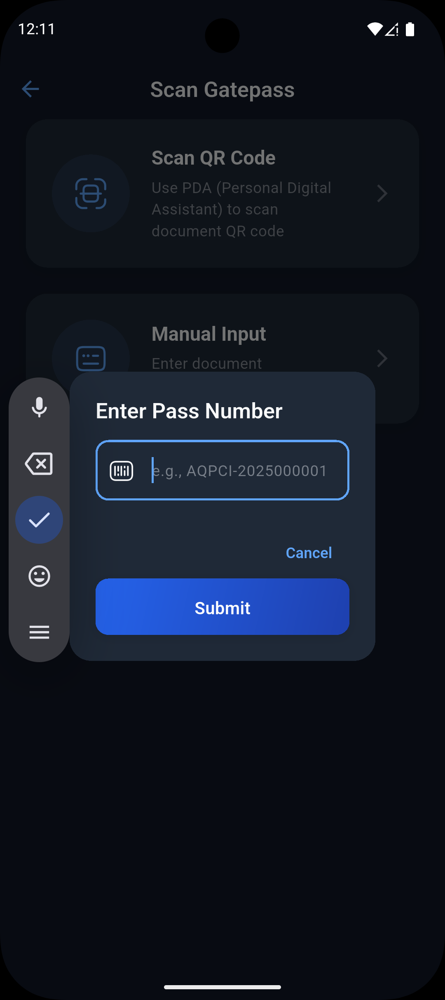</td>
  </tr>
  <tr>
    <td colspan="2" align="center"><i>Detailed gate pass information and verification</i></td>
  </tr>
</table>

</details>

<details open>
<summary><b>👤 User Profile</b></summary>

<table>
  <tr>
    <td align="center"><b>Light Mode</b></td>
    <td align="center"><b>Dark Mode</b></td>
  </tr>
  <tr>
    <td>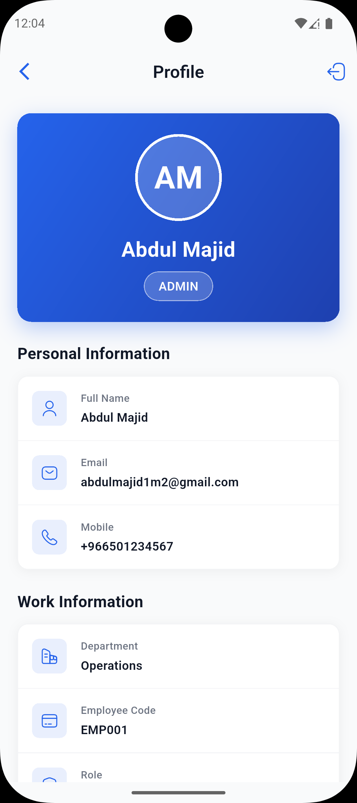</td>
    <td>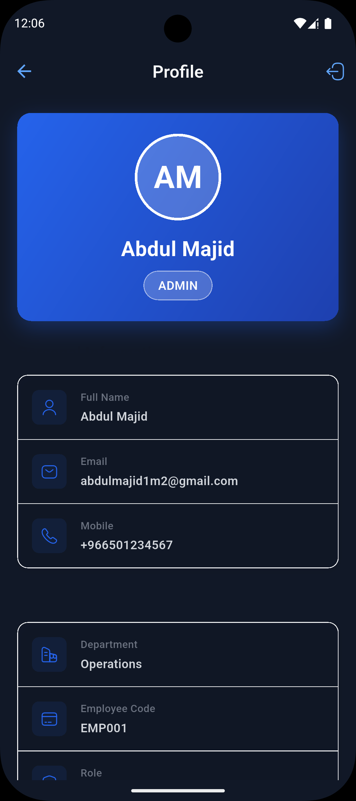</td>
  </tr>
  <tr>
    <td colspan="2" align="center"><i>User profile with settings and preferences</i></td>
  </tr>
</table>

</details>

---

## 🌟 Features

### 🔌 Connectivity Management

- **Real-time Network Monitoring** - Instant detection of connectivity changes
- **Intelligent Overlay System** - Non-intrusive no-internet screen overlay
- **State Preservation** - Maintains app state during connectivity changes
- **Automatic Recovery** - Seamless transition when connection is restored

### 🎫 Gate Pass System

- **QR Code Scanning** - Quick and accurate gate pass verification
- **Item Verification** - Detailed item-by-item verification process
- **Real-time Status** - Live updates on gate pass status
- **Comprehensive Details** - Full gate pass information display

### 📊 Dashboard & Analytics

- **Interactive Charts** - Visual representation using FL Chart
- **Real-time Statistics** - Live data updates
- **Member Management** - Complete member information system
- **Performance Metrics** - Track and analyze key metrics

### 🎨 User Experience

- **Material 3 Design** - Modern, fluid UI components
- **Dark Mode Support** - Beautiful dark theme throughout
- **Responsive Layout** - Adapts to different screen sizes
- **Smooth Animations** - Polished transitions and interactions

### 🏗️ Technical Excellence

- **Clean Architecture** - Separation of concerns with proper layering
- **State Management** - Riverpod for predictable state handling
- **Offline Support** - Local caching with SharedPreferences
- **Type-safe Routing** - GoRouter for declarative navigation

---

## 🏗️ Architecture

### 🔄 Connectivity Wrapper Architecture

The app uses a sophisticated wrapper-based approach for handling connectivity:

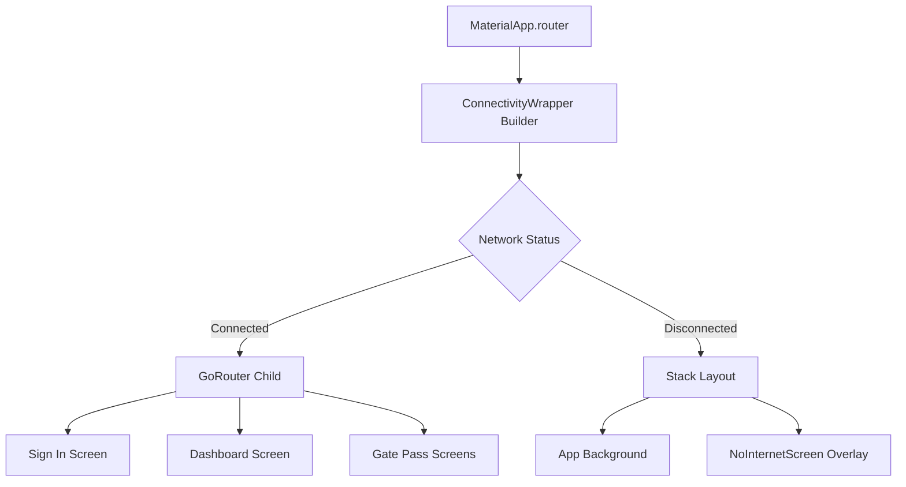

### ⚙️ How It Works

1. **🔌 Connectivity Wrapper** - Wraps the entire app using MaterialApp's `builder` parameter
2. **📡 Stream-based Monitoring** - Continuously watches network status via `connectivity_plus`
3. **📚 Stack Overlay** - Displays no-internet screen on top when disconnected
4. **⚡ Instant Response** - No navigation needed, overlay appears/disappears immediately
5. **💾 State Preservation** - Underlying app remains in memory with preserved state

### 📂 Project Structure

```text
┌─────────────────────────────────────┐
│     MaterialApp.router              │
│                                     │
│  ┌───────────────────────────────┐ │
│  │  builder: ConnectivityWrapper │ │
│  │                               │ │
│  │  ┌─────────────────────────┐ │ │
│  │  │   GoRouter (child)      │ │ │  ← Your app runs normally
│  │  │   - SignInScreen        │ │ │
│  │  │   - Other screens       │ │ │
│  │  └─────────────────────────┘ │ │
│  │                               │ │
│  │  When disconnected:           │ │
│  │  ┌─────────────────────────┐ │ │
│  │  │   Stack                 │ │ │
│  │  │   ├─ App (background)   │ │ │  ← App stays in memory
│  │  │   └─ NoInternetScreen   │ │ │  ← Overlay appears
│  │  └─────────────────────────┘ │ │
│  └───────────────────────────────┘ │
└─────────────────────────────────────┘
```

### How It Works

1. **Connectivity Wrapper** wraps the entire app using MaterialApp's `builder` parameter
2. **Stream-based Monitoring** continuously watches network status via `connectivity_plus`
3. **Stack Overlay** displays no-internet screen on top when disconnected
4. **Instant Response** - No navigation needed, overlay appears/disappears immediately
5. **State Preservation** - Underlying app remains in memory with preserved state

### Project Structure

```text
lib/
├── 📱 main.dart                        # App entry point with ConnectivityWrapper
├── 🎨 app.dart                         # Root app configuration
├── 🔧 core/
│   ├── constants/
│   │   └── app_colors.dart            # App-wide color definitions
│   ├── router/
│   │   ├── app_router.dart            # GoRouter configuration
│   │   └── app_routes.dart            # Route constants
│   └── utils/                          # Utility functions
├── 🎯 presentation/
│   ├── features/
│   │   ├── 🔐 auth/                    # Authentication module
│   │   │   ├── providers/
│   │   │   │   └── signin_provider.dart
│   │   │   └── view/
│   │   │       └── signin_screen.dart
│   │   ├── 📊 dashboard/               # Dashboard & Analytics
│   │   │   ├── providers/
│   │   │   └── view/
│   │   │       ├── dashboard_screen.dart
│   │   │       └── member_details_screen.dart
│   │   ├── 🎫 gatepass/                # Gate Pass Management
│   │   │   ├── providers/
│   │   │   └── view/
│   │   │       ├── scan_gatepass_screen.dart
│   │   │       ├── gatepass_details_screen.dart
│   │   │       ├── gatepass_verification_screen.dart
│   │   │       ├── gatepass_scan_items_screen.dart
│   │   │       └── gatepass_item_verification_screen.dart
│   │   └── 🔌 connectivity/            # Connectivity handling
│   │       ├── providers/
│   │       │   └── connectivity_provider.dart
│   │       └── view/
│   │           └── no_internet_screen.dart
│   └── 🧩 widgets/                     # Reusable widgets
│       ├── custom_button_widget.dart
│       ├── custom_scaffold.dart
│       └── custom_text_field.dart
├── 📦 repos/                            # Repository layer
└── 🔧 services/                         # Services layer
    ├── connectivity_service.dart       # Network monitoring
    └── shared_preferences_service.dart # Local storage
```

---

---

## 🚀 Getting Started

### 📋 Prerequisites

- **Flutter SDK**: `>=3.9.0`
- **Dart SDK**: `>=3.9.0`
- **IDE**: VS Code, Android Studio, or IntelliJ IDEA
- **Devices**: iOS Simulator, Android Emulator, or physical device

### 📦 Dependencies

This project uses the following key packages:

```yaml
dependencies:
  # 🎯 Core Framework
  flutter:
    sdk: flutter

  # 🔄 State Management & Navigation
  flutter_riverpod: ^3.0.1 # Robust state management
  go_router: ^16.2.4 # Declarative routing

  # 🌐 Network & Connectivity
  connectivity_plus: ^7.0.0 # Network status monitoring
  dio: ^5.9.0 # HTTP client

  # 💾 Data Persistence
  shared_preferences: ^2.3.5 # Local key-value storage

  # 🎨 UI Components
  iconsax: ^0.0.8 # Beautiful icon set
  cached_network_image: ^3.4.1 # Cached images
  fl_chart: ^0.69.0 # Interactive charts

  # 🔧 Utilities
  intl: ^0.20.2 # Internationalization
  cupertino_icons: ^1.0.8 # iOS-style icons
```

### 🛠️ Installation

1. **Clone the repository**

   ```bash
   git clone https://github.com/Wasim-Zaman/pcq_fir_pilot_app.git
   cd pcq_fir_pilot_app
   ```

2. **Install dependencies**

   ```bash
   flutter pub get
   ```

3. **Run the app**

   ```bash
   # Run on connected device/emulator
   flutter run

   # Run on specific device
   flutter devices
   flutter run -d <device_id>

   # Run in release mode
   flutter run --release
   ```

---

## 🔑 Key Components

### 1️⃣ ConnectivityWrapper (`main.dart`)

The heart of the connectivity monitoring system:

```dart
class ConnectivityWrapper extends ConsumerWidget {
  final Widget? child;

  const ConnectivityWrapper({super.key, this.child});

  @override
  Widget build(BuildContext context, WidgetRef ref) {
    final connectivityStatus = ref.watch(connectivityStatusProvider);

    return connectivityStatus.when(
      data: (status) {
        if (status == ConnectivityStatus.disconnected) {
          return Stack(
            children: [
              if (child != null) child!,
              const Positioned.fill(child: NoInternetScreen()),
            ],
          );
        }
        return child ?? const SizedBox.shrink();
      },
      loading: () => const MaterialApp(
        home: Scaffold(
          body: Center(child: CircularProgressIndicator()),
        ),
      ),
      error: (error, stackTrace) => MaterialApp(
        home: Scaffold(
          body: Center(child: Text('Error: $error')),
        ),
      ),
    );
  }
}
```

### 2️⃣ ConnectivityService (`services/connectivity_service.dart`)

Monitors network status in real-time:

```dart
class ConnectivityService {
  final Connectivity _connectivity = Connectivity();

  Stream<ConnectivityStatus> get connectivityStream async* {
    // Check initial connectivity
    final initialResult = await _connectivity.checkConnectivity();
    yield _mapConnectivityResult(initialResult);

    // Listen to connectivity changes
    await for (final result in _connectivity.onConnectivityChanged) {
      yield _mapConnectivityResult(result);
    }
  }

  ConnectivityStatus _mapConnectivityResult(List<ConnectivityResult> results) {
    if (results.contains(ConnectivityResult.mobile) ||
        results.contains(ConnectivityResult.wifi) ||
        results.contains(ConnectivityResult.ethernet)) {
      return ConnectivityStatus.connected;
    }
    return ConnectivityStatus.disconnected;
  }
}
```

### 3️⃣ Connectivity Provider (`providers/connectivity_provider.dart`)

Riverpod provider for state management:

```dart
final connectivityServiceProvider = Provider<ConnectivityService>((ref) {
  return ConnectivityService();
});

final connectivityStatusProvider = StreamProvider<ConnectivityStatus>((ref) {
  final connectivityService = ref.watch(connectivityServiceProvider);
  return connectivityService.connectivityStream;
});
```

---

## ✨ Benefits of This Architecture

<div align="center">

| Feature                   | Benefit                                                    |
| ------------------------- | ---------------------------------------------------------- |
| ⚡ **Immediate Response** | No navigation delays, overlay appears/disappears instantly |
| 🎯 **State Preservation** | App doesn't lose its place during connectivity changes     |
| 🔄 **True Overlay**       | Modal-like behavior based on real-time connectivity        |
| 🌐 **Works Everywhere**   | Wraps entire router, so works on all screens               |
| 🧩 **Clean Separation**   | Router focuses on navigation, wrapper handles connectivity |
| 📱 **Native Feel**        | Seamless user experience with instant feedback             |
| 💪 **Production Ready**   | Battle-tested architecture used in real-world apps         |
| 🔧 **Easy Maintenance**   | Clear separation of concerns, easy to debug and extend     |

</div>

---

---

## 🧪 Testing

### Run Tests

```bash
# Run all tests
flutter test

# Run tests with coverage
flutter test --coverage

# Run specific test file
flutter test test/widget_test.dart
```

### Test Structure

```text
test/
├── widget_test.dart          # Widget tests
├── unit_tests/              # Unit tests
└── integration_tests/       # Integration tests
```

---

## 📦 Build & Deploy

### 🤖 Android

```bash
# Debug APK
flutter build apk --debug

# Release APK
flutter build apk --release

# App Bundle (for Play Store)
flutter build appbundle --release
```

### 🍎 iOS

```bash
# Debug build
flutter build ios --debug

# Release build
flutter build ios --release

# Create IPA
flutter build ipa --release
```

### 🌐 Web

```bash
# Build for web
flutter build web --release

# Serve locally
flutter run -d chrome
```

### 💻 Desktop

```bash
# macOS
flutter build macos --release

# Linux
flutter build linux --release

# Windows
flutter build windows --release
```

---

## 📱 Supported Platforms

<div align="center">

| Platform       | Status       | Version                |
| -------------- | ------------ | ---------------------- |
| 🤖 **Android** | ✅ Supported | API 21+ (Android 5.0+) |
| 🍎 **iOS**     | ✅ Supported | iOS 12.0+              |
| 🌐 **Web**     | ✅ Supported | All modern browsers    |
| 🖥️ **macOS**   | ✅ Supported | macOS 10.14+           |
| 🐧 **Linux**   | ✅ Supported | Ubuntu 20.04+          |
| 🪟 **Windows** | ✅ Supported | Windows 10+            |

</div>

---

## 🎨 Design System

### Color Palette

```dart
// Light Theme
primaryColor: #2196F3 (Blue)
secondaryColor: #FFC107 (Amber)
backgroundColor: #FFFFFF
surfaceColor: #F5F5F5

// Dark Theme
primaryColor: #1976D2 (Dark Blue)
secondaryColor: #FFA000 (Dark Amber)
backgroundColor: #121212
surfaceColor: #1E1E1E
```

### Typography

- **Headings**: Inter / SF Pro Display
- **Body**: Inter / SF Pro Text
- **Monospace**: JetBrains Mono

---

## 🤝 Contributing

We welcome contributions! Here's how you can help:

### Steps to Contribute

1. **Fork the repository**

   ```bash
   gh repo fork Wasim-Zaman/pcq_fir_pilot_app
   ```

2. **Create a feature branch**

   ```bash
   git checkout -b feature/amazing-feature
   ```

3. **Make your changes**

   - Write clean, documented code
   - Follow the existing code style
   - Add tests for new features

4. **Commit your changes**

   ```bash
   git commit -m 'feat: add amazing feature'
   ```

5. **Push to your fork**

   ```bash
   git push origin feature/amazing-feature
   ```

6. **Open a Pull Request**

### Commit Convention

We follow [Conventional Commits](https://www.conventionalcommits.org/):

- `feat:` - New feature
- `fix:` - Bug fix
- `docs:` - Documentation changes
- `style:` - Code style changes (formatting, etc.)
- `refactor:` - Code refactoring
- `test:` - Adding or updating tests
- `chore:` - Maintenance tasks

---

## � Documentation

### Additional Resources

- 📚 [Flutter Documentation](https://docs.flutter.dev/)
- 🔄 [Riverpod Documentation](https://riverpod.dev/)
- 🗺️ [GoRouter Documentation](https://pub.dev/packages/go_router)
- 🌐 [Connectivity Plus Documentation](https://pub.dev/packages/connectivity_plus)
- 📊 [FL Chart Documentation](https://pub.dev/packages/fl_chart)
- 🔐 [SharedPreferences Documentation](https://pub.dev/packages/shared_preferences)

### Project Documentation

- [Architecture Guide](docs/ARCHITECTURE.md) _(Coming Soon)_
- [API Integration](docs/API.md) _(Coming Soon)_
- [State Management](docs/STATE_MANAGEMENT.md) _(Coming Soon)_
- [Testing Guide](docs/TESTING.md) _(Coming Soon)_

---

## � Known Issues & Troubleshooting

### Common Issues

<details>
<summary><b>Issue: Build fails on iOS</b></summary>

**Solution:**

```bash
cd ios
pod deintegrate
pod install
cd ..
flutter clean
flutter pub get
flutter run
```

</details>

<details>
<summary><b>Issue: Connectivity not detected</b></summary>

**Solution:**

- Ensure you have proper permissions in `AndroidManifest.xml`
- Check iOS `Info.plist` for network permissions
- Test on a physical device (emulators may not reflect real network changes)
</details>

<details>
<summary><b>Issue: Charts not displaying</b></summary>

**Solution:**

```bash
flutter clean
flutter pub get
flutter run
```

</details>

---

## 📈 Roadmap

### Version 1.1.0 (Planned)

- [ ] 🌍 Multi-language support (i18n)
- [ ] 🔔 Push notifications
- [ ] 📊 Advanced analytics dashboard
- [ ] 🔐 Biometric authentication
- [ ] 📱 iPad optimization

### Version 1.2.0 (Planned)

- [ ] 🌙 Auto dark mode based on system
- [ ] 📥 Offline data sync
- [ ] 🎨 Customizable themes
- [ ] 📊 Export reports (PDF/CSV)
- [ ] 🔍 Advanced search & filters

---

## 📄 License

This project is licensed under the **MIT License** - see the [LICENSE](LICENSE) file for details.

```text
MIT License

Copyright (c) 2025 Wasim Zaman

Permission is hereby granted, free of charge, to any person obtaining a copy
of this software and associated documentation files (the "Software"), to deal
in the Software without restriction, including without limitation the rights
to use, copy, modify, merge, publish, distribute, sublicense, and/or sell
copies of the Software, and to permit persons to whom the Software is
furnished to do so, subject to the following conditions:

The above copyright notice and this permission notice shall be included in all
copies or substantial portions of the Software.
```

---

## 👥 Team

<div align="center">

### 💼 Project Lead

**Wasim Zaman**

[](https://github.com/Wasim-Zaman)
[](https://linkedin.com/in/wasim-zaman)

</div>

---

## 📧 Contact & Support

### Get in Touch

- 🐛 **Bug Reports**: [Open an issue](https://github.com/Wasim-Zaman/pcq_fir_pilot_app/issues)
- 💡 **Feature Requests**: [Submit a request](https://github.com/Wasim-Zaman/pcq_fir_pilot_app/issues/new)
- 📧 **Email**: [contact@example.com](mailto:contact@example.com)
- 💬 **Discussions**: [GitHub Discussions](https://github.com/Wasim-Zaman/pcq_fir_pilot_app/discussions)

---

## ⭐ Show Your Support

If you found this project helpful, please consider:

- ⭐ **Starring** the repository
- 🔄 **Sharing** with others
- 🐛 **Reporting** bugs
- 💡 **Suggesting** new features
- 🤝 **Contributing** to the codebase

---

## 🙏 Acknowledgments

Special thanks to:

- 🎨 **Flutter Team** - For the amazing framework
- 📦 **Package Maintainers** - For the excellent packages
- 👥 **Community** - For continuous support and feedback
- 🎯 **Contributors** - For making this project better

---

<div align="center">

### 🚀 Built with ❤️ using Flutter

**[⬆ Back to Top](#-pcq-fir-pilot-app)**

---

**PCQ FIR Pilot App** • Version 1.0.0 • © 2025 Wasim Zaman

</div>
